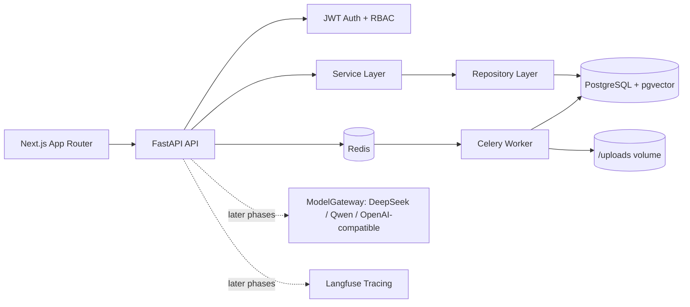

# SmartDocs AI - Enterprise RAG SaaS

SmartDocs AI is a production-style Enterprise RAG SaaS platform with document upload,
hybrid retrieval (vector + keyword + RRF), source citations, multi-tenant RBAC,
atomic credit billing, usage logs, admin analytics, LangGraph pipeline, and Langfuse observability.

Built with: Next.js · FastAPI · PostgreSQL/pgvector · Redis/Celery · LangGraph · DeepSeek/Qwen · Langfuse · Docker

## Phase Status

Phase 1 foundation is implemented:

- Monorepo structure with `apps/web` and `services/api`
- FastAPI layered backend: router -> service -> repository -> model
- JWT auth: register, login, logout response, guest demo login
- Multi-tenant workspace model and owner/viewer membership
- Workspace dashboard endpoint with RBAC membership checks
- PostgreSQL/pgvector Alembic migration, Redis/Celery worker skeleton, uploads volume
- Next.js App Router frontend with login, register, guest login, workspaces, dashboard
- Docker Compose, `.env.example`, GitHub Actions CI, seed script

Later phases add document upload, indexing, LangGraph RAG, streaming chat, billing, observability, tests, and portfolio polish.

## Demo Accounts

After running the seed script:

| Email | Password | Role |
| --- | --- | --- |
| `platform_admin@smartdocs.ai` | `admin12345` | Platform admin |
| `demo@smartdocs.ai` | `demo12345` | Demo workspace owner |
| `guest@smartdocs.ai` | `guest123` | Guest viewer |

## Architecture



## Local Setup

```bash
cp .env.example .env
docker compose up --build
docker compose exec api python seed.py
```

Open:

- Frontend: http://localhost:3000
- API docs: http://localhost:8000/docs

## Development Commands

Frontend:

```bash
cd apps/web
npm install
npm run type-check
npm run lint
npm run dev
```

Backend:

```bash
cd services/api
pip install -r requirements.txt
ruff check app/
pytest tests/ -v
alembic upgrade head
uvicorn app.main:app --reload
```

## What This Project Proves For AI Native Roles

SmartDocs AI is structured to demonstrate full-stack AI SaaS engineering: tenant isolation, workspace RBAC, document pipelines, retrieval architecture, credit billing, observability, and deployment discipline. The first phase establishes the production skeleton before the RAG-specific phases are layered in.
