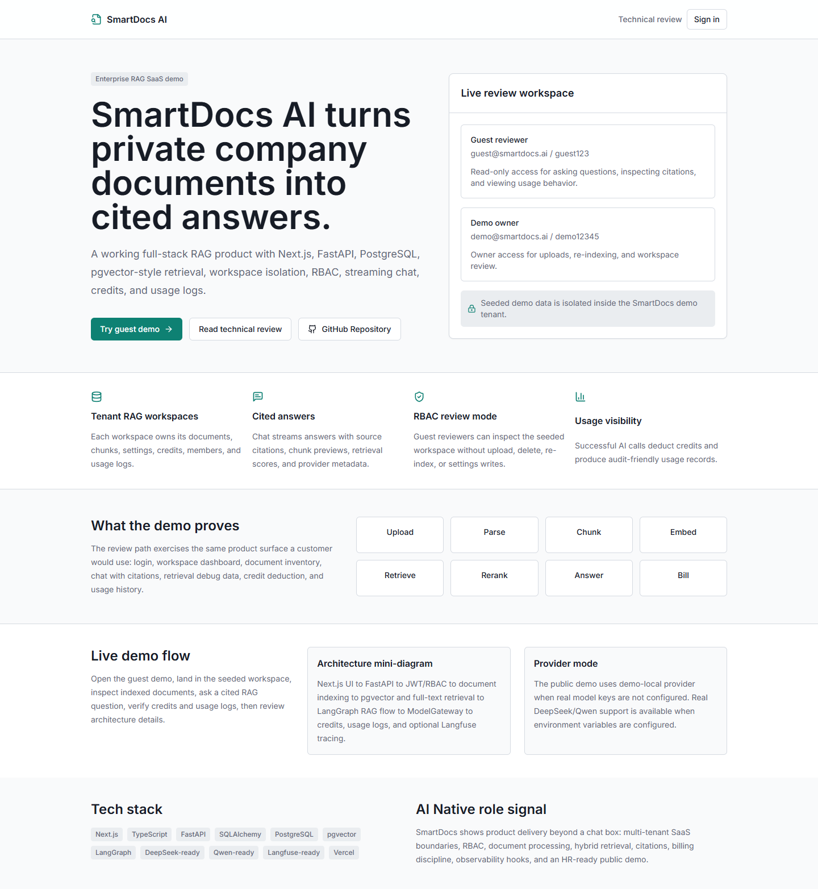
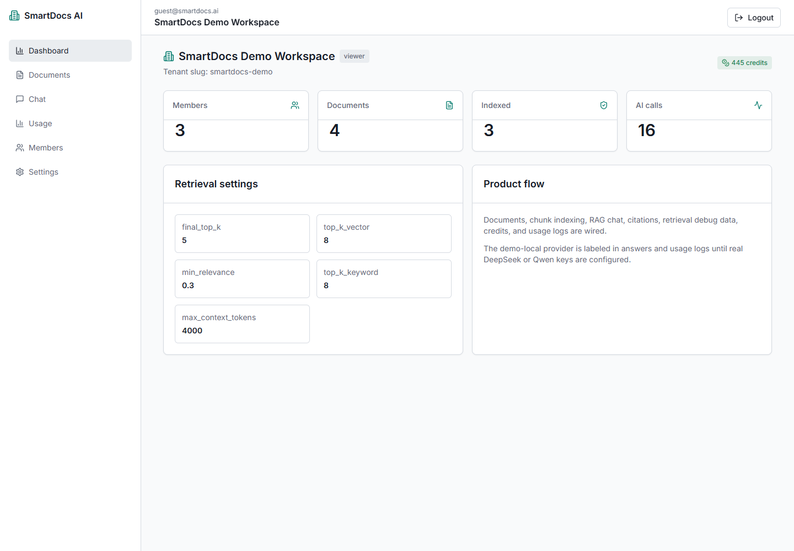
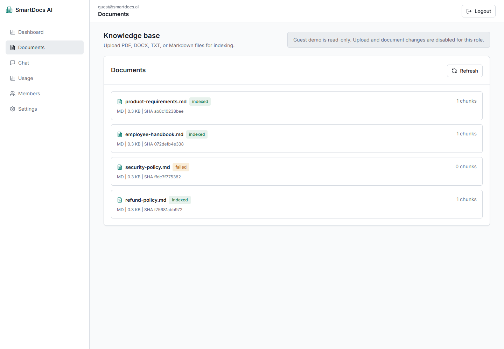
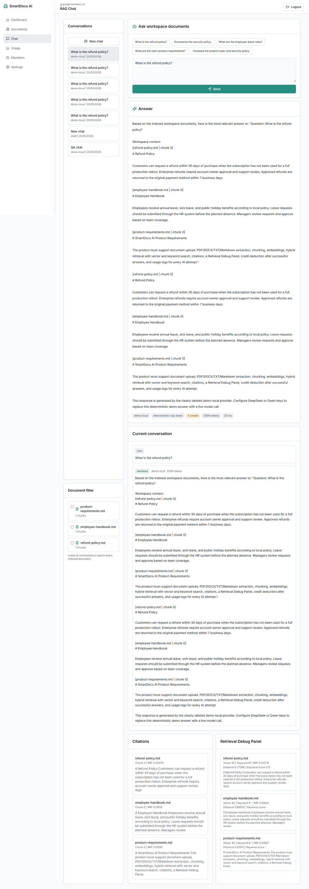
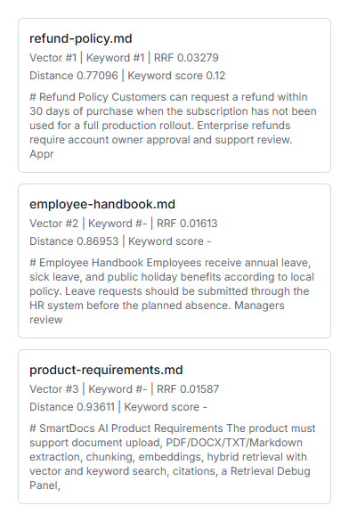
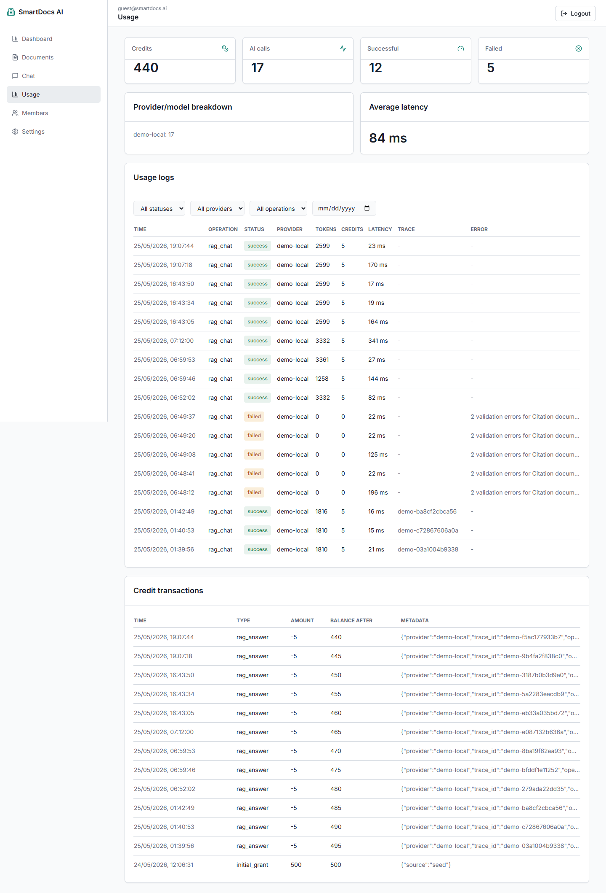
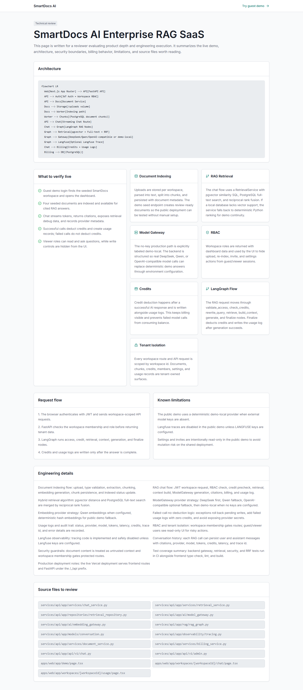
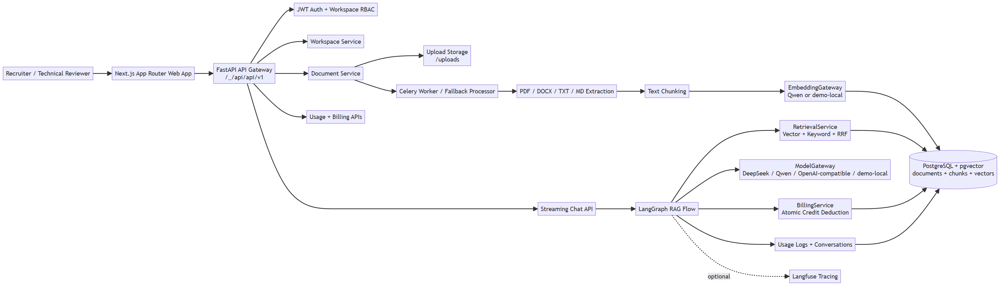

# SmartDocs AI - Production-Style Enterprise RAG SaaS Demo


SmartDocs AI is a production-style Enterprise RAG SaaS demo built to demonstrate AI Native Full-Stack engineering: a customer-facing product website, document upload, hybrid retrieval, cited RAG chat, workspace RBAC, credit billing, usage logs, LangGraph orchestration, and provider abstraction for DeepSeek/Qwen/OpenAI-compatible APIs.

The public demo can run in `demo-local` mode for stability and cost control. Real provider integrations are available when API keys are configured.

- Live demo: https://smartdocs-ai-three.vercel.app/
- Technical review: https://smartdocs-ai-three.vercel.app/technical-review
- Repository: https://github.com/Shifu710/smartdocs-ai

## Public Product Website

The public frontend now presents SmartDocs AI as a customer-facing product website first, while keeping HR and technical reviewer material available through secondary links.

- Product homepage: https://smartdocs-ai-three.vercel.app/
- Features: https://smartdocs-ai-three.vercel.app/features
- Use cases: https://smartdocs-ai-three.vercel.app/use-cases
- Pricing / evaluation scope: https://smartdocs-ai-three.vercel.app/pricing
- Security overview: https://smartdocs-ai-three.vercel.app/security
- Contact / reviewer paths: https://smartdocs-ai-three.vercel.app/contact

The marketing pages avoid fake customers, fake testimonials, fake logos, and fake payment links. The pricing page is intentionally evaluation-focused because commercial checkout and subscription packaging are not implemented in the public demo.

## For HR / Technical Reviewers

This project was created as a flagship AI Native Full-Stack portfolio project. It is designed to show practical AI SaaS product delivery beyond a simple chatbot.

### Recommended 5-minute review path

1. Open the live product website.
2. Click **Try live demo**.
3. Enter the seeded SmartDocs Demo Workspace.
4. Open **Documents** and confirm indexed demo files.
5. Open **Chat** and ask: `What is the refund policy?`
6. Check the streamed answer, citations, and Retrieval Debug Panel.
7. Open **Usage** and verify credit deduction and usage logs.
8. Open **Technical Review** for the architecture explanation.

### Demo credentials

| Account | Email | Password | Purpose |
| --- | --- | --- | --- |
| Guest reviewer | `guest@smartdocs.ai` | `guest123` | Read-only demo review |
| Demo owner | `demo@smartdocs.ai` | `demo12345` | Upload/re-index workspace review |
| Platform admin | `platform_admin@smartdocs.ai` | `admin12345` | Admin surface review |

## Core Features

- Next.js App Router frontend with customer-facing marketing pages and reviewer-friendly technical routes
- FastAPI backend with async SQLAlchemy, Alembic, and layered service/repository structure
- JWT authentication and guest demo login
- Multi-tenant workspaces with workspace RBAC
- Document upload for PDF, DOCX, TXT, and Markdown
- Document extraction, chunking, embeddings, and indexing
- PostgreSQL + pgvector retrieval with Qwen-ready embeddings and demo-local fallback
- Hybrid retrieval: vector search + keyword search + Reciprocal Rank Fusion
- LangGraph RAG flow with access checks, credit checks, retrieval, generation, and finalize steps
- Streaming chat with source citations and Retrieval Debug Panel data
- Dedicated conversations/messages tables for chat history
- Credits, usage logs, credit transactions, and zero-credit failed-call handling
- ModelGateway: DeepSeek, Qwen, OpenAI-compatible, and demo-local fallback
- EmbeddingGateway: Qwen embeddings when configured, or deterministic local demo embeddings for the public no-key demo
- Langfuse-ready observability when keys are configured
- Docker Compose local stack and GitHub Actions CI

## Screenshots

Screenshots are stored under `docs/assets/`. The screenshot capture plan is documented in [docs/assets/README.md](docs/assets/README.md).

### Landing Page


### Workspace Dashboard


### Documents Page


### RAG Chat with Citations


### Retrieval Debug Panel


### Usage Logs and Credit Transactions


### Technical Review Page


## Demo Video

A short 60-120 second walkthrough will be added here after final recording.

Planned flow:

1. Open the product homepage.
2. Click **Try live demo**.
3. Enter the guest demo workspace.
4. Open **Documents** and review indexed files.
5. Open **Chat** and ask: `What is the refund policy?`
6. Inspect cited answer and Retrieval Debug Panel.
7. Open **Usage** and verify credit deduction and usage logs.
8. Open **Technical Review**.

> The video should show the live deployed app and should not hide `demo-local` provider mode if it appears in the UI.

## Architecture Diagram



See the detailed Mermaid architecture diagram in [docs/architecture.md](docs/architecture.md).

SmartDocs AI follows a production-style AI SaaS architecture: Next.js frontend, FastAPI backend, JWT/RBAC workspace access, document indexing, pgvector/full-text retrieval, LangGraph RAG orchestration, ModelGateway provider abstraction, credit billing, usage logs, and Langfuse-ready observability.

## What This Project Proves

SmartDocs AI demonstrates:

- AI Native Full-Stack product delivery, not only prompt usage.
- Multi-tenant SaaS architecture with workspace isolation.
- Document processing pipeline: upload, parse, chunk, embed, index.
- RAG implementation with citations and retrieval debug data.
- Hybrid retrieval using vector search, full-text search, and Reciprocal Rank Fusion.
- Credit billing discipline: successful calls deduct credits, failed calls deduct zero.
- Provider abstraction for DeepSeek, Qwen, OpenAI-compatible APIs, and demo-local fallback.
- LangGraph orchestration and Langfuse-ready observability.
- Practical deployment discipline with Docker, Vercel, `.env.example`, CI, and QA docs.

## Public Demo Provider Mode

The public deployment can run in `demo-local` mode when real provider keys are not configured. This keeps the demo stable and cost-safe for public review.

When configured with API keys, the same ModelGateway supports:

- DeepSeek chat models
- Qwen chat models
- OpenAI-compatible chat models

When configured with Qwen embedding credentials, the EmbeddingGateway can use Qwen embeddings. Otherwise, deterministic demo embeddings keep the public demo testable.

## Local Setup

```bash
cp .env.example .env
docker compose up --build
docker compose exec api python seed.py
```

Open:

- Frontend: http://localhost:3000
- API docs: http://localhost:8000/docs

## Provider Configuration

Set provider keys in `.env` when you want live model calls:

```bash
AI_PROVIDER_MODE=auto
DEEPSEEK_API_KEY=...
QWEN_API_KEY=...
OPENAI_API_KEY=...
EMBEDDING_PROVIDER=auto
QWEN_EMBEDDING_MODEL=text-embedding-v3
LANGFUSE_ENABLED=true
LANGFUSE_PUBLIC_KEY=...
LANGFUSE_SECRET_KEY=...
```

If keys are missing, the app falls back to `demo-local` and clearly labels that mode in the UI, chat metadata, and usage logs.

## Key API Routes

- `GET /health`
- `GET /api/v1/health`
- `GET /api/v1/warmup`
- `POST /api/v1/auth/guest`
- `GET /api/v1/workspaces`
- `GET /api/v1/workspaces/{workspace_id}/dashboard`
- `GET /api/v1/workspaces/{workspace_id}/documents`
- `POST /api/v1/workspaces/{workspace_id}/documents/upload`
- `POST /api/v1/workspaces/{workspace_id}/chat/stream`
- `GET /api/v1/workspaces/{workspace_id}/usage`
- `GET /api/v1/workspaces/{workspace_id}/conversations`

On Vercel, the FastAPI app is mounted under `/_/api`, so the API v1 base is `/_/api/api/v1`.

## Development Commands

Frontend:

```bash
cd apps/web
npm install
npm run type-check
npm run lint
npm run build
```

Backend:

```bash
cd services/api
pip install -r requirements.txt
ruff check app/ tests/
pytest tests/ -v
alembic upgrade head
uvicorn app.main:app --reload
```

## Known Limitations

- The public Vercel demo can run in `demo-local` mode when provider keys are not configured.
- Langfuse traces are written only when Langfuse keys are configured.
- Invite/settings writes are disabled in the public demo to keep the shared review tenant safe.
- Real commercial usage should use object storage instead of local uploads.
- A commercial deployment should add a formal security review, backups, monitoring, alerting, and stricter operational controls.

## Production QA Evidence

- Flagship checklist: [docs/flagship-readiness-checklist.md](docs/flagship-readiness-checklist.md)
- Production QA: [docs/production-qa.md](docs/production-qa.md)
- Live demo QA checklist: [docs/live-demo-qa-checklist.md](docs/live-demo-qa-checklist.md)
- Reviewer guide: [docs/reviewer-guide.md](docs/reviewer-guide.md)
- Demo video plan: [docs/demo-video-plan.md](docs/demo-video-plan.md)
- Roadmap: [ROADMAP.md](ROADMAP.md)
- Latest production URL: https://smartdocs-ai-three.vercel.app/

## Chinese Summary

SmartDocs AI is a production-style Enterprise RAG SaaS demo and flagship AI Native Full-Stack portfolio project. It demonstrates multi-tenant workspaces, document upload, vector and keyword retrieval, source citations, credit billing, usage logs, LangGraph RAG orchestration, ModelGateway provider abstraction, and Langfuse-ready observability.

SmartDocs AI 是一个生产风格的企业级 RAG SaaS 演示项目，也是 AI Native Full-Stack 旗舰作品。它展示了多租户工作区、文档上传、向量和关键词混合检索、引用来源、积分扣费、用量日志、LangGraph RAG 编排、模型网关抽象，以及在配置密钥后可接入 Langfuse 的可观测能力。公开演示环境可能使用 `demo-local` 模式，以保证稳定和成本可控。
