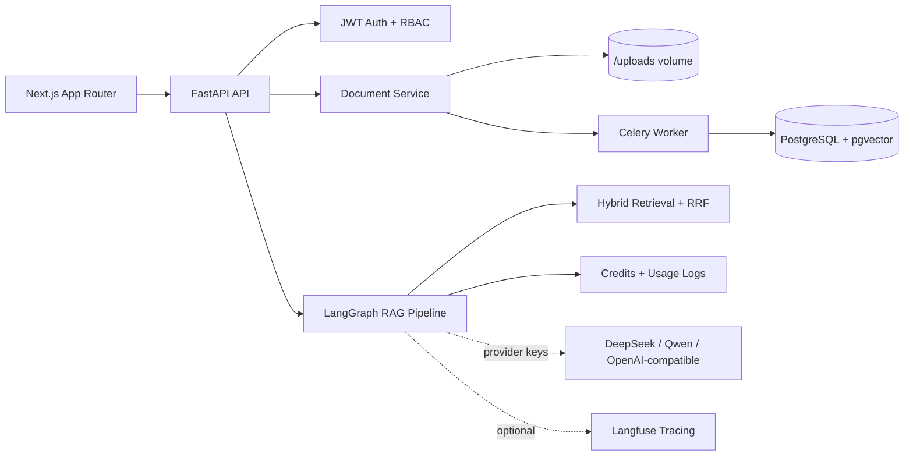

# SmartDocs AI - Enterprise RAG SaaS

SmartDocs AI is a production-style Enterprise RAG SaaS platform with document upload,
hybrid retrieval (vector + keyword + RRF), source citations, multi-tenant RBAC,
atomic credit billing, usage logs, admin analytics, a LangGraph-style pipeline, and
Langfuse-ready observability.

Built with: Next.js, FastAPI, PostgreSQL/pgvector, Redis/Celery, LangGraph,
DeepSeek/Qwen-ready model gateway, and Docker.

## Phase Status

Phase 1 through the first demo-ready RAG loop are implemented:

- Monorepo structure with `apps/web` and `services/api`
- FastAPI layered backend: router -> service -> repository -> model
- JWT auth: register, login, logout response, guest demo login
- Multi-tenant workspace model and RBAC membership checks
- Workspace dashboard endpoint and frontend
- Document list, upload, detail, chunk display, delete, and re-index endpoints
- PDF, DOCX, TXT, and Markdown extraction through Celery document processing
- Deterministic demo-local embeddings stored as pgvector-compatible 1024-dimension vectors
- Hybrid retrieval scoring with vector-style overlap, keyword ranking, and RRF merge
- POST streaming RAG chat with citations and Retrieval Debug Panel data
- Atomic credit deduction after successful answers and zero deduction on failure
- Usage logs and credit transactions for AI attempts
- Guest seed data with four pre-indexed demo documents
- Technical review page at `/technical-review`
- Docker Compose, `.env.example`, GitHub Actions CI, seed script

The no-key demo path is intentionally labeled `demo-local` in the UI and logs.
Configure DeepSeek, Qwen, or OpenAI-compatible keys to replace deterministic demo
responses with live model calls.

## Demo Accounts

After running the seed script:

| Email | Password | Role |
| --- | --- | --- |
| `platform_admin@smartdocs.ai` | `admin12345` | Platform admin |
| `demo@smartdocs.ai` | `demo12345` | Demo workspace owner |
| `guest@smartdocs.ai` | `guest123` | Guest viewer |

## Demo Flow

1. Open the app and click Try Guest Demo.
2. Enter the SmartDocs Demo Workspace.
3. Open Documents and review the four seeded indexed documents.
4. Open Chat and ask `What is the refund policy?`.
5. Watch the streamed answer, citations, Retrieval Debug Panel, provider, tokens, credits, latency, and trace id.
6. Open Usage to confirm the successful AI call and credit deduction.
7. Open `/technical-review` for the architecture summary.

## Architecture



## Local Setup

```bash
cp .env.example .env
docker compose up --build
docker compose exec api python seed.py
```

Open:

- Frontend: http://localhost:3000
- API docs: http://localhost:8000/docs

## Key API Routes

- `GET /health`
- `POST /api/v1/auth/guest`
- `GET /api/v1/workspaces`
- `GET /api/v1/workspaces/{workspace_id}/documents`
- `POST /api/v1/workspaces/{workspace_id}/documents/upload`
- `POST /api/v1/workspaces/{workspace_id}/chat/stream`
- `GET /api/v1/workspaces/{workspace_id}/usage`

## Development Commands

Frontend:

```bash
cd apps/web
npm install
npm run type-check
npm run lint
npm run dev
```

Backend:

```bash
cd services/api
pip install -r requirements.txt
ruff check app/
pytest tests/ -v
alembic upgrade head
uvicorn app.main:app --reload
```

## Screenshot Placeholders

- Landing and guest demo login
- Workspace dashboard with credits
- Documents page with seeded files
- RAG chat with citations and Retrieval Debug Panel
- Usage logs with credit deduction
- Technical review page

## What This Project Proves For AI Native Roles

SmartDocs AI demonstrates full-stack AI SaaS engineering: tenant isolation,
workspace RBAC, document pipelines, retrieval architecture, credit billing,
observability hooks, and deployment discipline.
