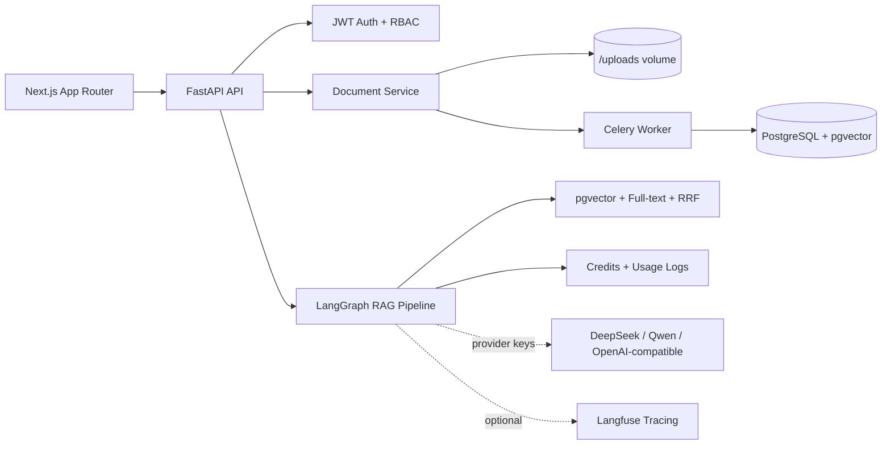

# SmartDocs AI - Enterprise RAG SaaS

SmartDocs AI is a production-style Enterprise RAG SaaS platform with document upload,
hybrid retrieval (vector + keyword + RRF), source citations, multi-tenant RBAC,
atomic credit billing, usage logs, admin analytics, real LangGraph nodes, and
optional Langfuse observability.

Built with: Next.js, FastAPI, PostgreSQL/pgvector, Redis/Celery, LangGraph,
DeepSeek/Qwen-ready model gateway, and Docker.

## Phase Status

Implemented product and engineering surface:

- Monorepo structure with `apps/web` and `services/api`
- FastAPI layered backend: router -> service -> repository -> model
- JWT auth: register, login, logout response, guest demo login
- Multi-tenant workspace model and RBAC membership checks
- Workspace dashboard endpoint and frontend
- Document list, upload, detail, chunk display, delete, and re-index endpoints
- PDF, DOCX, TXT, and Markdown extraction through Celery document processing
- ModelGateway with DeepSeek, Qwen, OpenAI-compatible fallback, and demo-local fallback
- EmbeddingGateway with Qwen support and deterministic demo-local fallback
- Embeddings stored as pgvector-compatible 1024-dimension vectors
- Hybrid retrieval with pgvector SQL, PostgreSQL full-text search, and RRF merge
- LangGraph nodes for access, credits, query rewrite, retrieval, context build, generation, and finalize
- POST streaming RAG chat with citations and Retrieval Debug Panel data including vector, keyword, and RRF fields
- Atomic credit deduction after successful answers and zero deduction on failure
- Usage logs, failed-call details, trace id, and credit transactions for AI attempts
- Dedicated conversation and message history for RAG chats
- Guest seed data with four pre-indexed demo documents
- Members and Settings pages so every sidebar route resolves
- Technical review page at `/technical-review`
- Docker Compose, `.env.example`, GitHub Actions CI, seed script

The public no-key demo path is intentionally labeled `demo-local` in the UI and logs.
When DeepSeek, Qwen, or OpenAI-compatible keys are configured, SmartDocs AI uses
ModelGateway to call real LLM providers. When Qwen embedding keys are configured,
EmbeddingGateway can produce real embeddings; otherwise it uses deterministic local
embeddings so the public demo remains stable.

Live demo: https://smartdocs-ai-three.vercel.app/
GitHub: https://github.com/Shifu710/smartdocs-ai

## Demo Accounts

After running the seed script:

| Email | Password | Role |
| --- | --- | --- |
| `platform_admin@smartdocs.ai` | `admin12345` | Platform admin |
| `demo@smartdocs.ai` | `demo12345` | Demo workspace owner |
| `guest@smartdocs.ai` | `guest123` | Guest viewer |

## Demo Flow

1. Open the app and click Try Guest Demo.
2. Enter the SmartDocs Demo Workspace.
3. Open Documents and review the four seeded indexed documents.
4. Open Chat and ask `What is the refund policy?`.
5. Watch the streamed answer, citations, Retrieval Debug Panel, provider, tokens, credits, latency, and trace id.
6. Open Usage to confirm the successful AI call and credit deduction.
7. Open `/technical-review` for the architecture summary.

## Architecture



## Provider Configuration

Set provider keys in `.env` when you want live model calls:

```bash
AI_PROVIDER_MODE=auto
DEEPSEEK_API_KEY=...
QWEN_API_KEY=...
OPENAI_API_KEY=...
EMBEDDING_PROVIDER=auto
QWEN_EMBEDDING_MODEL=text-embedding-v3
LANGFUSE_ENABLED=true
LANGFUSE_PUBLIC_KEY=...
LANGFUSE_SECRET_KEY=...
```

If keys are missing, the app falls back to `demo-local` and clearly labels that mode.

## Local Setup

```bash
cp .env.example .env
docker compose up --build
docker compose exec api python seed.py
```

Open:

- Frontend: http://localhost:3000
- API docs: http://localhost:8000/docs

## Key API Routes

- `GET /health`
- `POST /api/v1/auth/guest`
- `GET /api/v1/workspaces`
- `GET /api/v1/workspaces/{workspace_id}/documents`
- `POST /api/v1/workspaces/{workspace_id}/documents/upload`
- `POST /api/v1/workspaces/{workspace_id}/chat/stream`
- `GET /api/v1/workspaces/{workspace_id}/usage`
- `GET /api/v1/workspaces/{workspace_id}/conversations`

## Development Commands

Frontend:

```bash
cd apps/web
npm install
npm run type-check
npm run lint
npm run dev
```

Backend:

```bash
cd services/api
pip install -r requirements.txt
ruff check app/
pytest tests/ -v
alembic upgrade head
uvicorn app.main:app --reload
```

## Known Limitations

- The public Vercel demo can run in `demo-local` mode when provider keys are not configured.
- Langfuse traces are written only when Langfuse keys are configured.
- Invite/settings writes are disabled in the public demo to keep the shared review tenant safe.
- Conversation history endpoints are intentionally minimal until the full persisted chat UI is expanded.

## Screenshot Placeholders

- Landing and guest demo login
- Workspace dashboard with credits
- Documents page with seeded files
- RAG chat with citations and Retrieval Debug Panel
- Usage logs with credit deduction
- Technical review page

## Chinese Summary

SmartDocs AI is an enterprise RAG knowledge-base SaaS project. It supports multi-tenant workspaces, document upload,
vector retrieval, source citations, credit billing, usage logs, LangGraph RAG flow, ModelGateway, and Langfuse-ready
observability.

SmartDocs AI 是一个企业级 RAG 知识库 SaaS 项目，支持多租户工作区、文档上传、向量检索、引用来源、积分扣费、用量日志、LangGraph RAG 流程、模型网关和 Langfuse 可观测性。

## Production QA Evidence

- Flagship checklist: `docs/flagship-readiness-checklist.md`
- Production QA: `docs/production-qa.md`
- Latest production URL: https://smartdocs-ai-three.vercel.app

## What This Project Proves For AI Native Roles

SmartDocs AI demonstrates full-stack AI SaaS engineering: tenant isolation,
workspace RBAC, document pipelines, retrieval architecture, credit billing,
observability hooks, and deployment discipline.
