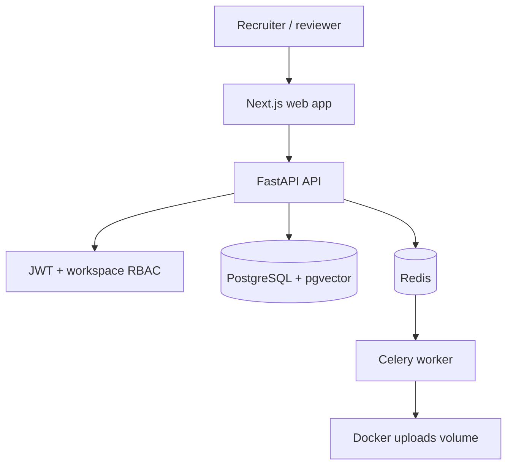

# Architecture

SmartDocs AI uses a split frontend/backend monorepo.

- `apps/web`: Next.js App Router, TypeScript, Tailwind CSS, shadcn-style UI, TanStack Query
- `services/api`: FastAPI, Pydantic v2, async SQLAlchemy, Alembic
- PostgreSQL stores tenants, users, documents, chunks, usage logs, and credits
- pgvector stores `vector(1024)` embeddings for later RAG phases
- Redis backs Celery document-processing tasks
- `/uploads` is mounted into both API and worker containers

