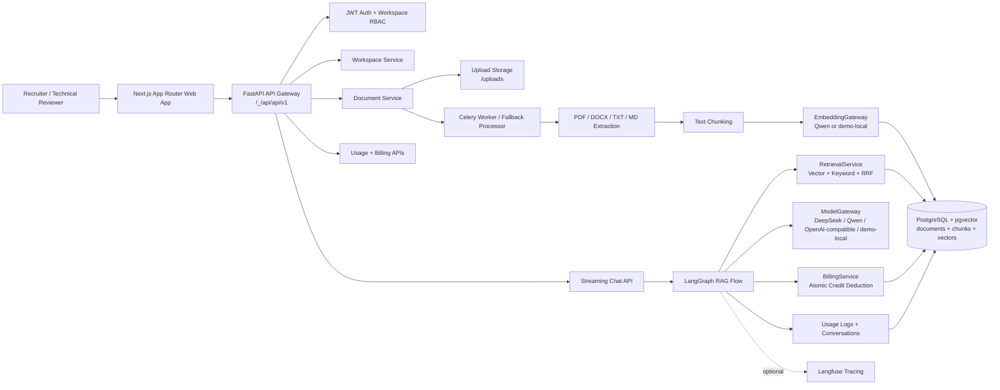

# SmartDocs AI Architecture

SmartDocs AI is a production-style Enterprise RAG SaaS demo. It demonstrates how a real AI document intelligence product can be structured across frontend, backend, data, RAG, billing, and observability layers.

## System Overview



## 1. Frontend Layer

Location:

```txt
apps/web
```

Responsibilities:

```txt
Public landing page
Login/register
Guest demo entry
Workspace dashboard
Documents page
Document detail page
RAG chat page
Retrieval Debug Panel
Usage dashboard
Members/settings pages
Technical review page
```

Main technologies:

```txt
Next.js App Router
TypeScript
Tailwind CSS
shadcn-style UI components
TanStack Query
ReadableStream / Server-Sent Events for chat streaming
```

## 2. Backend API Layer

Location:

```txt
services/api
```

Responsibilities:

```txt
Auth
Workspace management
Document management
Chat/RAG API
Usage logs
Credit transactions
Admin routes
Health/warmup routes
```

Main technologies:

```txt
FastAPI
Pydantic v2
SQLAlchemy async
Alembic
slowapi rate limiting
JWT bearer auth
```

## 3. Auth and RBAC

SmartDocs AI uses two permission layers:

```txt
Platform role:
- platform_admin
- user

Workspace role:
- owner
- admin
- member
- viewer
```

Important rules:

```txt
All protected workspace routes require membership.
Documents, chunks, usage logs, credits, settings, and conversations are scoped by workspace_id.
Guest users are read-only reviewers.
Guest users can ask questions but cannot upload/delete/re-index/invite/edit settings.
```

## 4. Document Processing Pipeline

Supported file types:

```txt
PDF
DOCX
TXT
Markdown
```

Document flow:

```txt
Upload
-> validate file type and size
-> store file
-> calculate SHA256 hash
-> create document record
-> process via Celery worker or fallback processor
-> extract text
-> split into chunks
-> generate embeddings
-> store chunks and vectors
-> mark document as indexed or failed
```

The public demo includes seeded documents so reviewers can test RAG immediately.

## 5. Embedding Gateway

The EmbeddingGateway abstracts embedding providers.

Modes:

```txt
Qwen embeddings when API key is configured
demo-local deterministic embeddings when keys are absent
```

This keeps the public demo stable while preserving a real provider integration path.

## 6. Retrieval System

SmartDocs AI uses hybrid retrieval:

```txt
Vector search through pgvector
Keyword search through PostgreSQL full-text search
Reciprocal Rank Fusion for merged ranking
```

Retrieval must always filter by:

```txt
workspace_id
document_id when a document filter is selected
document status = indexed
```

The response includes citation data and retrieval debug data:

```txt
document name
chunk id
chunk index
page number
preview
vector rank
keyword rank
vector distance
keyword score
RRF score
```

## 7. LangGraph RAG Flow

The RAG request is orchestrated by LangGraph.

Flow:

```txt
validate_access
-> check_credits
-> rewrite_query
-> retrieve
-> build_context
-> generate
-> finalize
```

Responsibilities:

```txt
validate_access: confirms conversation/document workspace ownership
check_credits: verifies balance before model call
rewrite_query: normalizes the question
retrieve: gets relevant chunks
build_context: builds grounded context
generate: calls ModelGateway
finalize: creates citations, messages, usage log, credit transaction
```

## 8. Model Gateway

The ModelGateway abstracts chat model providers.

Provider order:

```txt
DeepSeek
Qwen
OpenAI-compatible
demo-local fallback
```

Important rule:

```txt
The public demo may run in demo-local mode when real provider keys are not configured.
This must be clearly labeled in README, UI, and technical review docs.
```

## 9. Credits and Usage Logs

SmartDocs AI includes SaaS-style usage tracking.

Rules:

```txt
Check credits before RAG call.
Deduct credits only after successful answer generation.
Failed provider calls deduct zero credits.
Every success creates usage log and credit transaction.
Failures create usage log with credits_deducted = 0.
Credit deduction must be atomic.
```

This proves product/business logic beyond simple AI API calling.

## 10. Observability

SmartDocs AI is Langfuse-ready.

Behavior:

```txt
If Langfuse keys are configured, traces can be created.
If keys are absent, tracing disables safely.
```

Tracked concepts:

```txt
workspace id
user id
question
retrieval span
generation span
provider
model
tokens
latency
trace id
```

## 11. Deployment

Local development:

```txt
Docker Compose
PostgreSQL
Redis
FastAPI
Celery worker
Next.js frontend
```

Public demo:

```txt
Vercel frontend
FastAPI under /_/api
Demo-local provider mode when real keys are absent
```

Vercel routes:

```txt
Frontend: /
Backend health: /_/api/health
API v1: /_/api/api/v1
```

## 12. Known Limitations

The project is a production-style flagship demo, not a customer-managed SaaS offering.

Known limitations:

```txt
Public deployment may use demo-local provider mode.
Langfuse requires keys to be configured.
Real commercial usage should use object storage instead of local uploads.
A production customer deployment should add security review, backups, monitoring, and stricter ops controls.
Invite/settings writes may be limited in the public demo to protect the shared tenant.
```

## Reviewer Summary

SmartDocs AI demonstrates:

```txt
AI Native Full-Stack engineering
Enterprise RAG product thinking
Workspace isolation
Document processing
Hybrid retrieval
Citations
Provider abstraction
Billing and usage logs
Deployment and QA discipline
```

It should be presented as:

```txt
Production-style Enterprise RAG SaaS demo / flagship AI Native portfolio project.
```
